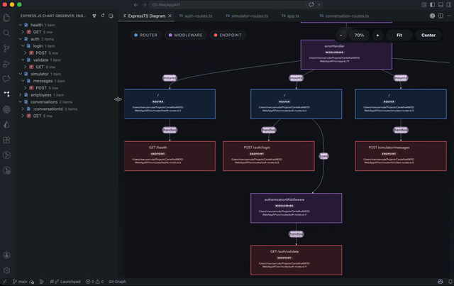
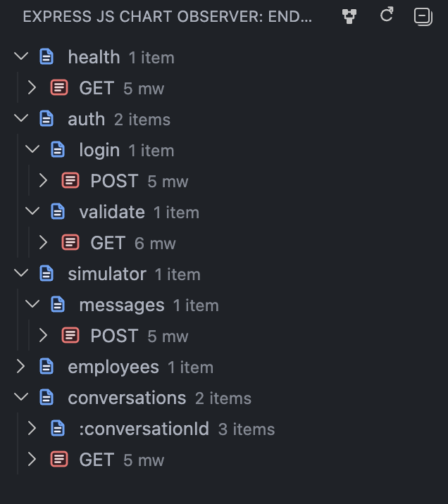
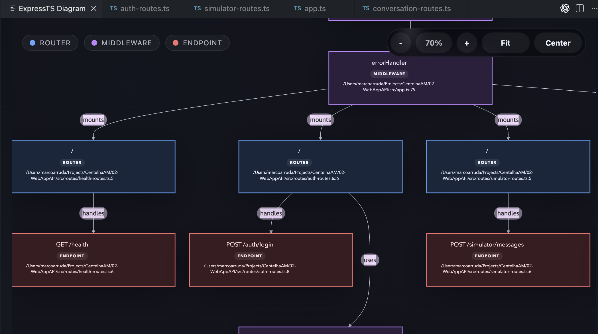

# ExpressJS Chart

ExpressJS Chart is a VS Code extension for exploring Express.js applications through static analysis. It scans your workspace, detects routers, endpoints, mounted paths, and middleware chains, then presents the result in both a navigable tree and an interactive diagram.



## What It Does

The extension gives you two complementary views of an Express codebase:

- an Endpoints tree in the Activity Bar for quick inspection
- a diagram webview for visualizing routers, middleware, and endpoint flow

It is designed for JavaScript and TypeScript Express projects and works directly from source files in the current workspace.

## Features

### Endpoint Explorer

Routes are grouped by path segments, and each endpoint can be expanded to reveal the middleware chain discovered for that route.

- inspect grouped paths
- see middleware counts per endpoint
- open endpoint source locations
- open middleware source locations



### Interactive Diagram

The diagram view renders the route graph in a webview so you can understand how routers and middleware connect across the application.

- router, middleware, and endpoint nodes
- zoom controls
- fit and center actions
- pan and inspect larger graphs
- click-through navigation to source



### Automatic Refresh

The analysis refreshes when supported files are saved. You can also trigger a manual refresh from the view toolbar.

## Supported Patterns

The analyzer supports common Express routing patterns, including:

- `express()` app instances
- `express.Router()` and `Router()` router instances
- `app.use()` and `router.use()` mounts
- local relative imports of routers and handlers
- routers exported directly from a module
- exported factory functions that return a local router instance
- route chains such as `router.route('/users').get(...).post(...)`
- middleware passed inline, by identifier, in arrays, or through simple call expressions
- CommonJS and ES module syntax

Example:

```ts
import express from 'express';
import usersRouter from './routes/users';

const app = express();

app.use('/api', authMiddleware, usersRouter);
app.get('/health', healthCheck);
```

It can also resolve local router factories such as:

```ts
export function createUsersRouter() {
  const router = Router();

  router.get('/users', listUsers);
  return router;
}
```

## Usage

1. Open a workspace containing an Express.js project.
2. Open the ExpressJS Chart view from the Activity Bar.
3. Expand the Endpoints tree to inspect routes and middleware.
4. Use Open Diagram to render the graph.
5. Click tree items or diagram nodes to jump to source.
6. Save files or use Refresh Diagram to update the analysis.

## Known Limitations

This extension relies on static AST analysis, so some patterns cannot be resolved completely.

- Route paths should be string literals for reliable detection.
- Dynamically generated paths or runtime-composed routers are only partially supported.
- Only local relative imports are followed when tracing router relationships.
- The analysis focuses on Express routing constructs, not arbitrary framework wrappers.
- Generated folders such as `node_modules`, `dist`, and `dist-webview` are ignored.
- Heavy abstractions around route registration may produce incomplete graphs.

## Development

### Scripts

- `npm run build` builds the extension and webview
- `npm run build:extension` builds the VS Code extension entry point
- `npm run build:webview` builds the webview bundle
- `npm run watch` watches the extension and webview during development
- `npm run package` creates a VSIX package

### Local Run

1. Install dependencies with `npm ci`.
2. Build once with `npm run build`.
3. Launch the extension in a VS Code Extension Development Host.